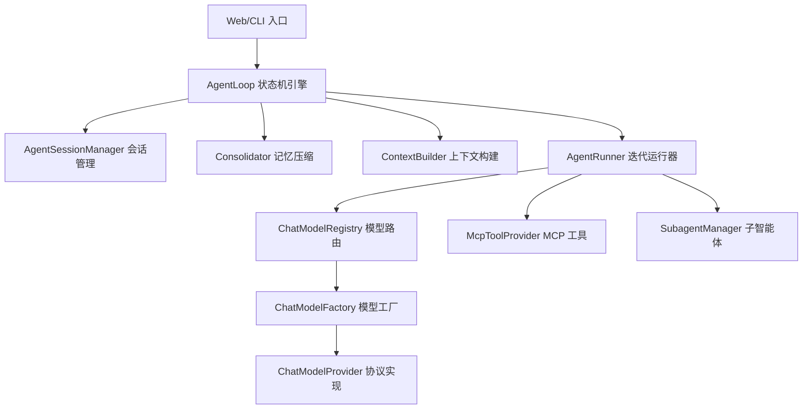
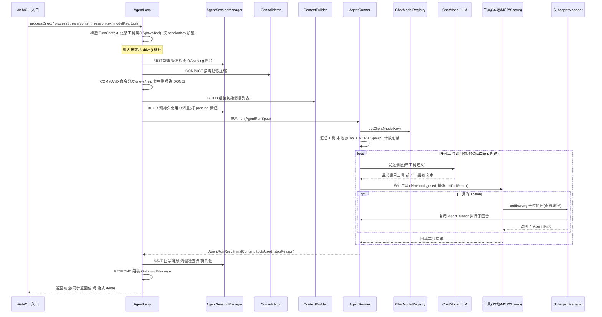
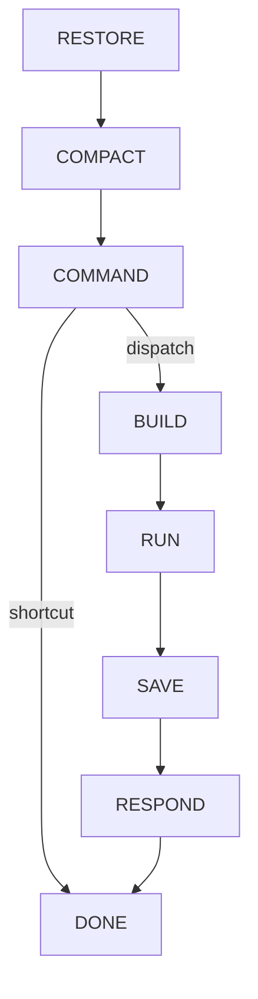
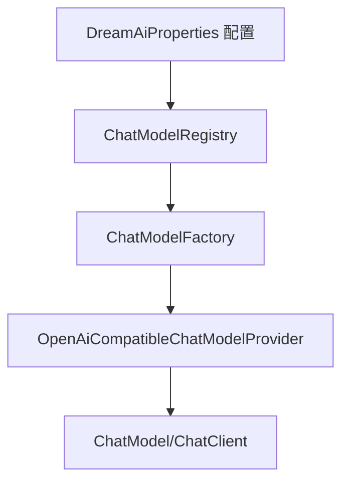

# Agent 核心技术分析文档

> 分析范围：`dream-service/src/main/java/com/example/dream/service/core/ai` 下与 Agent 相关的全部代码。
> 本模块借鉴 Python 项目 **nanobot** 的 Agent 设计，用 **Spring AI 2.0** 的内建能力（ChatClient / ToolCallingManager / MCP Client）在 JDK 21 上做了 1:1 语义还原与工程化重构。

---

## 一、整体架构

代码按职责分为四层：

| 层次 | 包 | 职责 |
| --- | --- | --- |
| 引擎层 | `agent` | 回合状态机与上下文 |
| 运行层 | `agent/runner`、`agent/subagent`、`agent/mcp` | 多轮工具循环、子智能体、MCP 集成 |
| 支撑层 | `agent/session`、`agent/context`、`agent/state`、`agent/message`、`agent/hook` | 会话、记忆、状态、消息、钩子 |
| 模型层 | `registry`、`factory`、`provider`、`config` | 多模型可配置切换与路由 |

---

## 二、整体流程顺序（一次请求的端到端调用链）

从一条用户消息进入到最终响应返回，完整调用顺序如下。

### 2.1 时序图

### 2.2 步骤说明

| 阶段 | 顺序步骤 | 关键动作 |
| --- | --- | --- |
| **入口** | 1 | Web/CLI 调用 `processDirect`（同步）或 `processStream`（流式），封装为 `InboundMessage` |
| **准备** | 2 | `process` 构造 `TurnContext`，把业务工具 + `SpawnTool` 组装为工具集，按 sessionKey 加 `ReentrantLock`（会话串行） |
| **RESTORE** | 3 | 恢复运行时检查点、补全上一回合中断的 pending 用户回合 |
| **COMPACT** | 4 | 历史超阈值时调用 LLM 压缩为摘要 |
| **COMMAND** | 5 | 命中 `/new`、`/help` 等内置命令则短路直达 DONE，否则 dispatch |
| **BUILD** | 6 | `ContextBuilder` 拼「系统提示 + 摘要 + 历史 + 当前消息」；预持久化用户消息并打 pending 标记 |
| **RUN** | 7 | `AgentRunner` 取 ChatClient、汇总并包装工具，进入 **ChatClient 内建的多轮工具循环**（模型请求工具→执行→回填→再请求），必要时经 SpawnTool 派生子智能体 |
| **SAVE** | 8 | 回写 assistant/tool 消息，过滤孤儿 tool 结果，记录 tools_used 与延迟，清理检查点并持久化 |
| **RESPOND** | 9 | 组装 `OutboundMessage`（含 stop_reason、latency 等元数据） |
| **返回** | 10 | 同步返回出站消息；流式模式下 delta 已在 RUN 阶段经 `onStream` 实时回调 |

> 说明：状态机由 `drive()` 循环驱动，每步依据处理器返回的事件查 `TRANSITIONS` 表决定下一状态，直至 `DONE`；每步耗时/事件记录进 `StateTraceEntry` 供观测。

---

## 三、核心引擎：事件驱动状态机（AgentLoop）

[`AgentLoop`](dream-backend/dream-service/src/main/java/com/example/dream/service/core/ai/agent/AgentLoop.java) 是整个 Agent 的处理引擎，采用**事件驱动状态机**驱动一个回合的完整生命周期。

### 状态流转

状态定义见 [`TurnState`](dream-backend/dream-service/src/main/java/com/example/dream/service/core/ai/agent/state/TurnState.java)，转移表用静态 `Map<"state|event", TurnState>` 声明（`TRANSITIONS`），`drive()` 循环驱动直至 `DONE`。

### 各状态职责

| 状态 | 处理器 | 作用 |
| --- | --- | --- |
| RESTORE | `stateRestore` | 恢复运行时检查点、补全中断的用户回合 |
| COMPACT | `stateCompact` | 按需触发记忆压缩 |
| COMMAND | `stateCommand` | 处理 `/new`、`/help` 等内置命令，命中则短路到 DONE |
| BUILD | `stateBuild` | 组装初始消息列表，预持久化用户消息并打 pending 标记 |
| RUN | `stateRun` | 委托 `AgentRunner` 执行多轮工具循环 |
| SAVE | `stateSave` | 回写 assistant/tool 消息，过滤孤儿 tool 结果，清理检查点 |
| RESPOND | `stateRespond` | 组装出站消息 |

### 关键设计点

- **每会话串行、跨会话并发**：用 `ConcurrentHashMap<String, ReentrantLock>` 按 sessionKey 加锁。
- **回合上下文**：[`TurnContext`](dream-backend/dream-service/src/main/java/com/example/dream/service/core/ai/agent/TurnContext.java) 作为可变载体在各状态间传递中间态。
- **执行轨迹**：每个状态执行耗时/事件/异常记录进 [`StateTraceEntry`](dream-backend/dream-service/src/main/java/com/example/dream/service/core/ai/agent/state/StateTraceEntry.java)，用于观测调试。
- **入口**：`processDirect`（同步）与 `processStream`（流式）两个直连入口。

---

## 四、多轮工具循环运行器（AgentRunner）

[`AgentRunner`](dream-backend/dream-service/src/main/java/com/example/dream/service/core/ai/agent/runner/AgentRunner.java) 是 RUN 状态的核心，**用 Spring AI ChatClient 内建的工具调用循环**取代 nanobot 的手写迭代。

### 工作机制

1. 通过 [`ChatModelRegistry`](dream-backend/dream-service/src/main/java/com/example/dream/service/core/ai/registry/ChatModelRegistry.java) 按 modelKey 取 `ChatClient`。
2. 将 [`AgentMessage`](dream-backend/dream-service/src/main/java/com/example/dream/service/core/ai/agent/message/AgentMessage.java) 转为 Spring AI 的 `Message`（含 tool 结构还原）。
3. 工具经 `ToolCallingChatOptions.builder().toolCallbacks(...)` 传入（Spring AI 2.0 规范写法）。
4. ChatClient 内建 `ToolCallingManager` 自动完成「模型请求工具 → 框架执行 → 回填结果 → 再请求模型」的多轮迭代。

### 工具汇总（resolveToolCallbacks）

- **本地 @Tool**：`MethodToolCallbackProvider` 从工具对象生成 `ToolCallback`。
- **MCP 工具**：由 `McpToolProvider` 合并。
- **计数包装**：每个工具用内部 `record CountingToolCallback` 包裹，工具真正被调用时记录 `tools_used` 并触发 [`AgentHook`](dream-backend/dream-service/src/main/java/com/example/dream/service/core/ai/agent/hook/AgentHook.java)`.onToolResult`。

### 同步 vs 流式

- 同步：`request.call().content()`。
- 流式：`request.stream().chatResponse()` 逐 delta 回调 `onStream`。

停止原因：正常=`stop`，空回复=`empty_final_response`，异常=`error`（见 [`AgentRunResult`](dream-backend/dream-service/src/main/java/com/example/dream/service/core/ai/agent/runner/AgentRunResult.java)、[`AgentRunSpec`](dream-backend/dream-service/src/main/java/com/example/dream/service/core/ai/agent/runner/AgentRunSpec.java)）。

---

## 五、子智能体机制（Subagent）

[`SubagentManager`](dream-backend/dream-service/src/main/java/com/example/dream/service/core/ai/agent/subagent/SubagentManager.java) + [`SpawnTool`](dream-backend/dream-service/src/main/java/com/example/dream/service/core/ai/agent/subagent/SpawnTool.java) 实现"主 Agent 派生子 Agent"能力。

- **暴露方式**：`SpawnTool` 以 Spring AI `@Tool` 形式挂载到主 Agent，`AgentLoop.process` 组装工具集时注入（不含 spawn 自身以防递归）。
- **执行引擎复用**：子 Agent 复用同一个 `AgentRunner`，带独立子智能体系统提示词。
- **并发模型**：JDK 21 **虚拟线程池**（`Executors.newVirtualThreadPerTaskExecutor`），由 `maxConcurrent`（默认 5）控并发上限。
- **结果回传**：与 nanobot「消息总线队列回注」不同，此处用**同步返回值/Future**（`runBlocking`/`runAsync`）直接把子 Agent 结论拼回主对话上下文，更直观。
- **状态跟踪**：`SubagentStatus` 记录 taskId、阶段（initializing/running/done/error）等。

---

## 六、会话与记忆管理

### 会话（Session）

- [`AgentSession`](dream-backend/dream-service/src/main/java/com/example/dream/service/core/ai/agent/session/AgentSession.java)：持有历史消息、元数据、摘要、时间戳；提供历史裁剪（`getHistory`，默认保留最近 40 条）、命令消息、子代理结果去重等能力。
- [`AgentSessionManager`](dream-backend/dream-service/src/main/java/com/example/dream/service/core/ai/agent/session/AgentSessionManager.java)：内存 `ConcurrentHashMap` 维护会话，`save()` 预留 DB 持久化扩展点。

### 中断恢复（Checkpoint）

[`RuntimeCheckpoint`](dream-backend/dream-service/src/main/java/com/example/dream/service/core/ai/agent/session/RuntimeCheckpoint.java) 在工具执行中周期性记录「assistant 消息 + 已完成工具结果 + 未完成工具调用」。回合被中断后由 `restoreRuntimeCheckpoint()` 物化进历史，并用**尾部重叠检测**避免重复追加；`restorePendingUserTurn()` 处理仅持久化了用户消息就崩溃的回合。

### 记忆压缩（Consolidator）

[`Consolidator`](dream-backend/dream-service/src/main/java/com/example/dream/service/core/ai/agent/context/Consolidator.java)：历史超过阈值（40 条）时，把最早一批消息交给 LLM 压缩成摘要，仅保留最近 20 条，控制上下文长度。

### 上下文构建（ContextBuilder）

[`ContextBuilder`](dream-backend/dream-service/src/main/java/com/example/dream/service/core/ai/agent/context/ContextBuilder.java)：把「系统提示 + 会话摘要 + 历史 + 当前用户消息」拼成初始消息列表，并在系统提示中注入当前时间等运行时信息。

---

## 六、MCP 工具集成

[`McpToolProvider`](dream-backend/dream-service/src/main/java/com/example/dream/service/core/ai/agent/mcp/McpToolProvider.java) 用 Spring AI 2.0 内建 MCP Client 承载（不移植 nanobot 自研 JSON-RPC 栈）：

- 通过 `ObjectProvider<SyncMcpToolCallbackProvider>` 优雅装配——**未配置 MCP 时 `getToolCallbacks()` 返回空列表**，不影响主 Agent。
- MCP server 工具由 Spring AI 自动暴露为 `ToolCallback`，在 AgentRunner 工具循环里同步执行。
- 支持 `reload()` 热重载（`invalidateCache()`），改为直接方法调用，无需消息总线。

---

## 七、回调与钩子

- [`AgentCallbacks`](dream-backend/dream-service/src/main/java/com/example/dream/service/core/ai/agent/hook/AgentCallbacks.java)：聚合 `onProgress`/`onStream`/`onStreamEnd`/`onRetryWait` 函数式回调，适配 CLI/SSE/WebSocket 等不同渠道，均可空实现。
- [`AgentHook`](dream-backend/dream-service/src/main/java/com/example/dream/service/core/ai/agent/hook/AgentHook.java)：在回合关键节点（开始/迭代/工具结果/结束）插入埋点、审计等自定义逻辑，默认空实现。

---

## 八、多模型可配置切换

模型层实现"运行时按 modelKey 切换模型"，核心是**注册表 + 工厂 + 协议提供者**三件套。

| 组件 | 职责 |
| --- | --- |
| [`DreamAiProperties`](dream-backend/dream-service/src/main/java/com/example/dream/service/core/ai/config/DreamAiProperties.java) / [`ProviderProperties`](dream-backend/dream-service/src/main/java/com/example/dream/service/core/ai/config/ProviderProperties.java) / [`ModelProperties`](dream-backend/dream-service/src/main/java/com/example/dream/service/core/ai/config/ModelProperties.java) | 「供应商 → 模型」两层配置结构，同网关多模型共享 baseUrl/apiKey |
| [`ChatModelRegistry`](dream-backend/dream-service/src/main/java/com/example/dream/service/core/ai/registry/ChatModelRegistry.java) | 启动时构建并缓存每个 modelKey 的 ChatClient/ChatModel，按 key 路由，支持 `refresh()` 热更新 |
| [`ChatModelFactory`](dream-backend/dream-service/src/main/java/com/example/dream/service/core/ai/factory/ChatModelFactory.java) | 按 provider.type 路由到对应 provider，新增协议只需加实现类 |
| [`OpenAiCompatibleChatModelProvider`](dream-backend/dream-service/src/main/java/com/example/dream/service/core/ai/provider/OpenAiCompatibleChatModelProvider.java) | OpenAI 兼容协议（通义/DeepSeek/Kimi/智谱/京东云网关等），连接参数模型级可覆盖供应商级 |

**默认模型优先级**：`primary` 标记 > 配置 `defaultModel` > 第一个模型。

---

## 九、消息模型

[`AgentMessage`](dream-backend/dream-service/src/main/java/com/example/dream/service/core/ai/agent/message/AgentMessage.java) 是会话持久化与回合内传递的中间载体，与 Spring AI `Message` 互转，含 role/content/toolCalls/toolCallId/media/injectedEvent/subagentTaskId/command 等字段。入站 [`InboundMessage`](dream-backend/dream-service/src/main/java/com/example/dream/service/core/ai/agent/message/InboundMessage.java) 与出站 [`OutboundMessage`](dream-backend/dream-service/src/main/java/com/example/dream/service/core/ai/agent/message/OutboundMessage.java) 承载渠道入口/出口数据。

---

## 十、技术亮点总结

1. **事件驱动状态机**：回合生命周期清晰可观测，易扩展新状态与命令。
2. **拥抱 Spring AI 内建能力**：工具循环、MCP、流式全部复用框架能力，避免重复造轮子。
3. **JDK 21 虚拟线程**：子智能体高并发 I/O 场景下轻量高效。
4. **可插拔多模型**：配置驱动，新增模型改 yml，新增协议加实现类，符合开闭原则。
5. **健壮的中断恢复**：检查点 + pending 标记 + 孤儿 tool 结果过滤，保证上下文一致性。
6. **优雅降级**：MCP 未配置时不影响主流程。