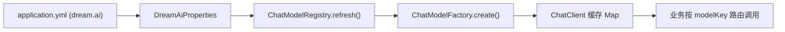
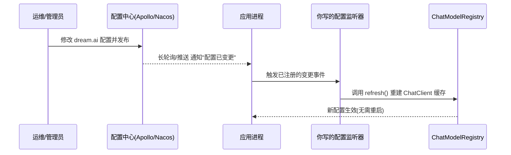

# 多模型配置动态生效方案

> 本文档记录 `dream-service` 多模型模块（`core/ai`）在生产环境下**修改模型配置能否实时生效**的分析，以及业界主流的动态配置方案与落地示例。

---

## TL;DR

| 问题 | 结论 |
| --- | --- |
| 线上改 `application.yml` 的模型配置，能自动生效吗？ | **不能**，必须重启进程才生效。 |
| 为什么？ | 配置在启动时一次性绑定到内存，`ChatClient` 缓存后固定，磁盘文件变更不会回推到运行中的进程。 |
| 主流解决方案？ | 配置中心（Nacos / Apollo）监听变更 → 回调 `refresh()` 重建缓存；或配置入库 + 管理后台触发刷新。 |

---

## 1. 背景与问题

当前多模型能力目录 `core/ai` 采用「供应商 → 模型」两层配置结构，核心链路如下：



**核心疑问**：项目生产上线后，运维在服务器上修改配置文件里的模型配置（新增模型、切换 baseUrl、换 apiKey 等），运行中的线上服务能不能感知到？

---

## 2. 为什么改配置文件不生效

### 2.1 配置只在启动时绑定一次

```java
@ConfigurationProperties(prefix = "dream.ai")
public class DreamAiProperties { ... }
```

`DreamAiProperties` 是一个普通的 Spring 单例 Bean，`@ConfigurationProperties` 只在 **Bean 初始化时**把 `application.yml` 的内容绑定进来一次，之后不会再随文件变化更新。

### 2.2 缓存在 @PostConstruct 时构建完成

```java
@PostConstruct
public void init() {
    refresh();   // 启动时构建所有 ChatClient 并缓存到 clientCache
}
```

`ChatModelRegistry` 在 `refresh()` 中把每个模型构建成 `ChatClient` 放入 `ConcurrentHashMap` 缓存。启动后这份缓存就固定了。

### 2.3 打包后配置是静态文件

`application.yml` 被打进 jar 包（或作为外部静态文件），属于本地磁盘资源。**修改磁盘文件不会回推到已经启动的 JVM 进程**，进程内存里的配置对象不会随之变化。

### 结论

> 虽然 `ChatModelRegistry` 已经预留了 `refresh()` 热更新方法，但**没有任何入口去触发它**，所以线上改完配置只能靠**重启**才能生效。

---

## 3. 主流动态生效方案

### 方案对比

| 方案 | 生效方式 | 是否需重启 | 适用场景 | 复杂度 |
| --- | --- | --- | --- | --- |
| 配置中心（Nacos / Apollo） | 推送变更 → 自动回调刷新 | 否 | 云原生、多实例集群 | 中 |
| 配置入库 + 管理后台 | 后台改完调用 `refresh()` | 否 | 模型需可视化管理、频繁增删 | 中高 |
| Actuator `/refresh` + `@RefreshScope` | 手动调刷新端点 | 否 | 简单项目、少量实例 | 低 |
| 传统重启 | 重新加载配置 | **是** | 变更极少 | 最低 |

**推荐**：云原生集群优先 **Nacos**；需要业务人员可视化管理模型则选 **配置入库 + 管理后台**。

---

## 4. 关键问题：配置中心怎么知道要调用 refresh()？

> **疑问**：「配置中心改配置 → 回调 refresh()」这一步，Apollo/Nacos 怎么知道要调用 `ChatModelRegistry.refresh()`？难道配置中心还支持配置回调方法？

**答案：配置中心并不知道、也不关心你有个叫 `refresh()` 的方法。**

真正的机制是：**配置中心只负责"通知配置变了"，"变了之后干什么"是由你在代码里注册的监听器决定的。** 也就是说，回调不是配置中心配的，而是**你自己在应用里写的监听器**。

流程拆解：



关键点：**"配置变了 → 调用 `refresh()`" 这根线，是你在应用代码里用监听器手动接上的。** 配置中心只提供「变更事件」这个钩子。

---

## 5. 落地示例

### 5.1 Apollo 方案

Apollo 通过 `@ApolloConfigChangeListener` 注册监听器。当 `dream.ai` 相关的 key 发生变化时，Apollo 客户端会回调你的方法，你在方法里调用 `refresh()`：

```java
@Slf4j
@Component
public class DreamAiConfigChangeListener {

    private final DreamAiProperties properties;
    private final ChatModelRegistry registry;

    public DreamAiConfigChangeListener(DreamAiProperties properties,
                                       ChatModelRegistry registry) {
        this.properties = properties;
        this.registry = registry;
    }

    @ApolloConfigChangeListener(interestedKeyPrefixes = "dream.ai")
    public void onChange(ConfigChangeEvent event) {
        log.info("[DreamAi] 检测到配置变更: {}", event.changedKeys());
        // 关键：变更后重新绑定 + 重建缓存
        registry.refresh();
    }
}
```

> 注意：`@ConfigurationProperties` 的 Bean 需要能感知到 Apollo 的最新值。
> 常见做法是给它加 `@RefreshScope`（配合 Apollo 的自动更新），或在监听器里手动重新绑定属性后再 `refresh()`。

### 5.2 Nacos 方案

Nacos 通过 `ConfigService.addListener` 或 Spring Cloud Alibaba 的 `@NacosConfigListener` 监听：

```java
@Slf4j
@Component
public class DreamAiNacosListener {

    private final ChatModelRegistry registry;

    public DreamAiNacosListener(ChatModelRegistry registry) {
        this.registry = registry;
    }

    @NacosConfigListener(dataId = "dream-ai.yaml")
    public void onChange(String newContent) {
        log.info("[DreamAi] Nacos 配置变更，触发刷新");
        registry.refresh();
    }
}
```

Spring Cloud Alibaba 场景下，也可以给 `DreamAiProperties` 或 `ChatModelRegistry` 加 `@RefreshScope`，配合 Nacos 自动刷新，再通过 `ApplicationListener<RefreshScopeRefreshedEvent>` 触发 `refresh()`。

### 5.3 配置入库 + 管理后台方案

模型配置存数据库，提供后台管理页面，改完后由管理接口显式触发刷新：

```java
@RestController
@RequestMapping("/admin/ai/models")
public class AiModelAdminController {

    private final ChatModelRegistry registry;

    public AiModelAdminController(ChatModelRegistry registry) {
        this.registry = registry;
    }

    @PostMapping("/refresh")
    public void refresh() {
        // 从 DB 重新加载配置到 DreamAiProperties 后重建缓存
        registry.refresh();
    }
}
```

> 多实例集群下，需要通过消息广播（如 Redis Pub/Sub、MQ）通知**所有实例**都执行 `refresh()`，否则只有收到请求的那一台生效。

---

## 6. refresh() 的线程安全说明

`ChatModelRegistry.refresh()` 已用 `synchronized` 修饰，且 `clientCache` / `modelMetaCache` 使用 `ConcurrentHashMap`，`defaultModelKey` 为 `volatile`。因此在刷新过程中并发读取是安全的。

> 潜在优化：当前 `refresh()` 会先 `clear()` 再逐个重建，极短时间内缓存为空可能导致正在进行的请求取不到 client。生产可优化为「构建新 Map → 原子替换」的双缓冲策略，避免刷新瞬间的空窗。

---

## 7. 小结

1. **现状**：改配置文件不生效，需重启。根因是配置启动时一次性绑定、缓存构建后固定。
2. **主流方案**：引入配置中心（Nacos/Apollo）监听变更，回调 `refresh()` 重建缓存。
3. **回调的本质**：配置中心只负责「通知变更」，「调用 `refresh()`」是你在应用里用监听器手动接上的，不是配置中心的能力。
4. **推荐路径**：云原生集群用 Nacos；需要可视化管理用「配置入库 + 后台 + 集群广播刷新」。